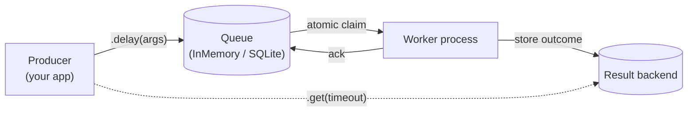

# miniq

A minimal, persistent task queue library for Python with pluggable storage backends, at-least-once delivery, and a tiny CLI.

```python
from miniq import Miniq

app = Miniq()

@app.task(max_retries=3)
def send_email(to: str, subject: str) -> str:
    return f"sent {subject!r} to {to}"

# Enqueue (returns instantly)
result = send_email.delay("alice@example.com", "Welcome")

# A worker (typically in another process) picks it up and runs it
app.worker(poll_wait_seconds=0.1).run_once()

# Fetch the result
print(result.get(timeout=5))
```

## Why this exists

miniq is a single-host task queue built from scratch as an exercise in understanding the architecture of systems like Celery, RQ, and SQS from the inside. The code is small enough to read end-to-end (~1,500 lines including tests) while exercising the same core abstractions real systems use: queue backends, result backends, workers, retry policies, visibility timeouts, dead-letter queues.

For production use, prefer Celery, RQ, or Arq.

## Features

- **Pluggable storage backends.** In-memory for dev and tests; SQLite (WAL mode, atomic claim transactions) for persistence and multi-worker setups.
- **At-least-once delivery** via visibility timeouts; tasks are reclaimed when workers crash.
- **Configurable retry policies**: exponential backoff (the default, so `max_retries=N` works out of the box), fixed delay, jittered backoff, no-retry.
- **Scheduled execution** via `countdown=N` (seconds) or `at=datetime`.
- **Per-task priorities** with FIFO tiebreaker.
- **Dead-letter queue** for terminally failed tasks.
- **Multi-process worker pool** with graceful SIGTERM shutdown via the `spawn` start method.
- **CLI**: `miniq worker`, `miniq status`, `miniq dlq list`, `miniq dlq replay`, `miniq purge`.
- **Type-safe**: full type hints, mypy strict, 100+ tests including parametrized integration tests proving both backends satisfy the same contract.

## Architecture



A producer calls `.delay()` on a decorated function, which enqueues a `Task` in the queue. A worker dequeues atomically (with a visibility timeout claim), executes the function, stores the outcome in the result backend, and acks. The producer can fetch the result via `AsyncResult.get()` from the result backend, optionally blocking.

## Installation

```bash
# From source
git clone https://github.com/ChristopherTablasDeLaCruz/miniq.git
cd miniq
uv sync
```

## Quickstart

```python
# tasks.py
from miniq import Miniq, SQLiteQueue, SQLiteResultBackend

app = Miniq(
    queue=SQLiteQueue("./miniq.db"),
    results=SQLiteResultBackend("./miniq.db"),
)

@app.task(max_retries=3)
def add(a: int, b: int) -> int:
    return a + b
```

```python
# producer.py
from tasks import add

result = add.delay(2, 3)
print(f"queued task {result.task_id}")
print(f"result: {result.get(timeout=30)}")
```

In a separate terminal, run a worker pool:

```bash
uv run miniq worker --db ./miniq.db --app tasks --workers 2
```

Then run the producer in the first terminal:

```bash
uv run python producer.py
```

The producer enqueues, blocks on `get()`, and the worker (running in parallel) processes the task and stores the result. The producer unblocks and prints `5`.

See the [`examples/`](examples/) directory for more.

## CLI

```bash
miniq worker --db ./miniq.db --app myapp.tasks --workers 4
miniq status --db ./miniq.db
miniq dlq list --db ./miniq.db
miniq dlq replay <task_id> --db ./miniq.db
miniq purge --db ./miniq.db --older-than 86400
```

Finished tasks and stored results accumulate in the database until purged. `miniq purge` deletes succeeded entries (and their results) older than `--older-than` seconds; failed tasks stay in the dead-letter queue for inspection unless you pass `--include-failed`.

`miniq --help` and `miniq <subcommand> --help` for details.

## Benchmarks

Single-process throughput on a 2025 MacBook Air (M4), no-op tasks:

| Backend      | Enqueue/s | Drain/s | End-to-end/s |
| ------------ | --------: | ------: | -----------: |
| InMemory     |   450,000 |  75,000 |       64,000 |
| SQLite (WAL) |    42,000 |  13,600 |       10,000 |

Reproduce:

```bash
uv run python benchmarks/throughput.py
```

The SQLite numbers reflect the WAL+NORMAL configuration and SQLite's single-writer constraint. Higher throughput is possible with batched commits or a Redis backend (not implemented).

## Design decisions

**At-least-once, not exactly-once.** Exactly-once requires distributed transactions across the queue and arbitrary task side effects (sending emails, charging cards). At-least-once with idempotent tasks is what SQS, Celery, and most production queues actually deliver. The trade-off is on the user: write tasks to be safe to run more than once.

**Visibility timeouts, not heartbeats.** Workers claim tasks with an expiration timestamp. If the worker doesn't ack within that window (because it crashed, hung, or just took too long), the task becomes claimable again on the next dequeue call. No background recovery process; recovery is opportunistic. Same model as SQS.

The sharp edge this buys: there is **no claim renewal**, so a task that runs longer than the visibility timeout (default 30s) is reclaimed and executed *concurrently* with the still-running original — the system cannot tell a slow worker from a dead one. Tasks must either finish comfortably within the visibility timeout or be idempotent under concurrent execution. For known-slow tasks, raise the window (`--visibility-timeout` on the CLI, `visibility_timeout=` on `Worker`/`WorkerPool`). There is also no worker-side task timeout: a genuinely hung task blocks its worker forever while copies of it pile up via reclaim. Fixing either properly means heartbeats or process-per-task supervision, which is real production-queue machinery beyond this project's scope.

**Spawn (not fork) for the worker pool.** Portable to Windows and safe for SQLite, which can't share connections across the fork boundary. Cost is slower worker startup; benefit is process isolation.

**JSON serialization by default.** Safe (no arbitrary code execution on deserialization, unlike pickle), portable across languages, debuggable (readable bytes on disk).

**Pluggable backends via abstract base classes.** The same integration test suite runs against `InMemoryQueue` and `SQLiteQueue` via a parametrized pytest fixture, proving the `QueueBackend` and `ResultBackend` contracts hold identically across implementations.

## License

MIT. See [LICENSE](LICENSE).
